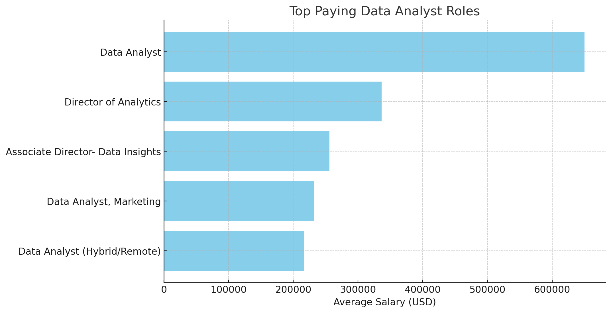

# Introduction
Hello, and thanks for stopping by!
This respository contains examples of SQL written during [Luke Barrouse's](https://www.lukebarousse.com/sql) data analytics course.
- SQL queries? Find them [here.](/project_sql/)

# Background
I tried to answer several questions related to job opportunities for data analysts' roles.

1. What are the top-paying data analyst jobs?
2. What skills are required for the top paying data analyst jobs?
3. What are the most in-demand skills for data anlyst?
4. What are the top skills based on salary?
5. What are the most optimal skills to learn (aka it's in high demand and a high-paying skill)?

# Tools I Used

- **SQL**
- **PostrgreSQL**
- **Visual Studio Code**
- **Git & Github**

# The Analysis

###  Q1. The highest paying role is a generic Data Analyst position with an average salary of $650,000. Leadership roles such as Director of Analytics and Associate Director- Data Insights also offer high salaries, indicating the value of experience and management skills in analytics. 


*Figure generated with ChatGPT.*

###  Q2. Candidates procuring professional opportunities should focus on building proficiency in SQL and Python to target top-paying remote data analyst roles.

###  Q3. The most demanded skills for data analysts are:
| Skills    | Demand Count |
|-----------|--------------|
| SQL       | 7291         |
| Excel     | 4611         |
| Python    | 4330         |
| Tableau   | 3745         |
| Power BI  | 2609         |

###  Q4. The top needed skills required for the positions with the highest salaries are:
- Machine Learning and AI: Skills related to machine learning and AI frameworks such as mxnet, keras, pytorch, tensorflow, and hugging face all command high salaries (ranging from $123,950 to $149,000). This underscores the growing importance of AI and machine learning in various industries.

The data suggests that professionals with specialized skills in niche technologies are commanding higher salaries. For instance, solidity (blockchain) and couchbase (modern databases) are highly paid, reflecting their specialized nature and the current market demand for these technologies. Moreover it highlights the growing importance of specialized, niche skills in technology, especially those related to blockchain, AI, and modern data management tools. Professionals aiming to stay competitive and command higher salaries should consider focusing on these emerging and high-demand areas. The trend towards automation and the integration of AI in data analysis is likely to continue, further emphasizing the need for expertise in these domains.

###  Q5. Insight into optimal skills in data analytics:
- Tools like PySpark, Bitbucket, Watson, and Couchbase command high salaries but have low demand, indicating a premium for niche expertise.
- Linux, Kubernetes, Atlassian, PostgreSQL, and Scala skills show specific demand and moderate salaries, underscoring their foundational role in various technical environments.

### Showcase of the SQL for Q5:

```sql
WITH skills_demand AS (
    SELECT 
        skills_dim.skill_id,
        skills_dim.skills,
        COUNT(skills_job_dim.job_id) AS demand_count
    FROM job_postings_fact
    INNER JOIN skills_job_dim ON job_postings_fact.job_id = skills_job_dim.job_id
    INNER JOIN skills_dim ON skills_job_dim.skill_id = skills_dim.skill_id
    WHERE 
        job_postings_fact.job_title_short = 'Data Analyst' 
        AND salary_year_avg IS NOT NULL 
        AND job_work_from_home = True
    GROUP BY 
        skills_dim.skill_id
), average_salary_sql AS (
    SELECT 
        skills_dim.skill_id,
        ROUND(AVG(salary_year_avg),0) as average_salary
    FROM job_postings_fact
    INNER JOIN skills_job_dim ON job_postings_fact.job_id = skills_job_dim.job_id
    INNER JOIN skills_dim ON skills_job_dim.skill_id = skills_dim.skill_id
    WHERE 
        job_postings_fact.job_title_short = 'Data Analyst'
        AND salary_year_avg IS NOT NULL 
        AND job_work_from_home = True
    GROUP BY 
        skills_dim.skill_id
)

SELECT
    skills_demand.skill_id,
    skills_demand.skills,
    skills_demand.demand_count,
    average_salary_sql.average_salary
FROM skills_demand
INNER JOIN average_salary_sql ON skills_demand.skill_id = average_salary_sql.skill_id
ORDER BY
    average_salary DESC,
    skills_demand.demand_count DESC
LIMIT 25;
```

